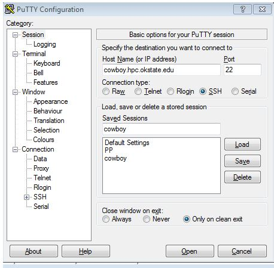
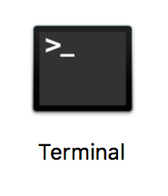
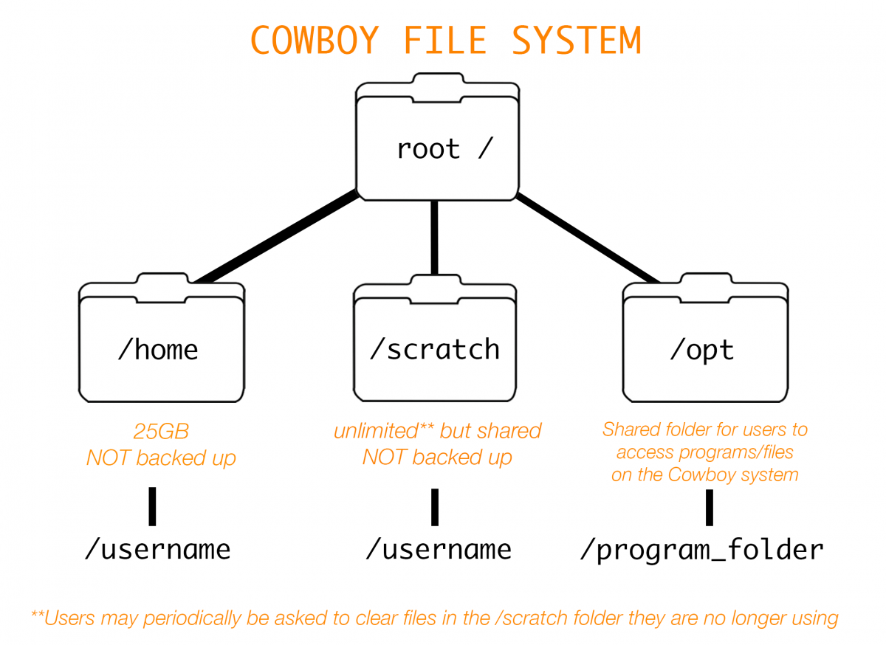

# Objectives

* Students will be able to log in to Cowboy.
* Students will use be able to navigate files and directories using bash.
* Students will learn several common bash commands.
* Students will use bash to make simple changes to files and directories.
* Students will be able to log out of Cowboy.


# Logging In
## Windows

* First [download Putty](https://the.earth.li/~sgtatham/putty/latest/x86/putty.exe "Putty"), save it to your desktop and then run it.
    * Make sure this link is on the ether-pad
* When you start Putty, window will open that looks like the image below.



* In the box labeled hostname, enter: cowboy.hpc.okstate.edu
* Make sure the Connection type is SSH and the Port number is 22.
* In the Saved Sessions box, you can give a name for these login settings, i.e. Cowboy. Click save.
    * The next time you open Putty, you can double click this saved session and it will open a terminal window that will be ready to log you into Cowboy.
* After clicking 'Open', you'll be prompted first to enter your Cowboy username. Hit 'Enter' after you've typed your username.
* Next you'll be prompted to enter your password followed by 'Enter'.
    * (**NOTE** your password will not show up on the screen as you type)
* If you entered your password correctly, you should get the command prompt.
    * If it says something like permission denied or login invalid, you might have entered your password incorrectly. Remember passwords are case sensitive.  

## Mac

* The Mac OS has a built-in terminal application so you won't need to download anything.
* To find your terminal: Double click on the hard drive icon >> the Applications folder >> the Utilities folder
* Double click on the Terminal icon:



* Now that you are in a terminal window, type `ssh username@cowboy.hpc.okstate.edu`
* Next you'll be prompted to enter your password followed by 'Enter'.
    * As a security measure, your password will not show up on the screen as you type.
* If you entered your password correctly, you should get the command prompt - a line ending in a $
* If you have a message that says permission denied or login invalid, you might have entered your password incorrectly. Remember passwords are case sensitive.

## Linux

* In a terminal type: `ssh username@cowboy.hpc.okstate.edu`
* Next you'll be prompted to enter your password followed by 'Enter'.
    * As a security measure, your password will not show up on the screen as you type.
* If you entered your password correctly, you should get the command prompt.
* If you have a message that says permission denied or login invalid, you might have entered your password incorrectly. Remember passwords are case sensitive.

# Password

First, you will need a secure password. To change from the default password to a password that is more secure (and easier to remember), we need to use the password command.

```bash
$ passwd
```

```bash
Changing password for user username.
Current Password: 
```

Type in your current password. Note: As a security feature, the cursor will not move while you type in passwords. Don't worry, the password is being typed in. When you have finished entering your password, hit the enter key. You will be prompted to type the new password twice.

```bash
New password: 
New password: 
```

You have now set a new password. Make sure your remember it for next time you log in.

# Navigating Files and Directories




In Cowboy, each user will have two basic directories: the home and the scratch.
* When you first log in, your current working directory is `/home/<username>`
     * `/home/<username>` has a quota of 25GB. Your source code and executables will be stored here. This filesystem is NOT BACKED UP, but it does have snapshots. To check your current usage type du -sh from your home directory. <
     * `/scratch/<username>` is a shared directory for large files and large collections of files. This filesystem is NOT BACKED UP.
* The `/opt` folder is shared and contains applications needed by users.   

What is the root?
* The first / in a file system path represents the root - or the first or top-most directory in your file system. 
     * When you log in to Cowboy, you are automatically in your home folder, which stems from the root. Your current working directory would look like `/home/<username>`, with the first / representing the root. 
* All proceeding / in a file path simply serve as dividers between any subsequent directories and files.     


Once you're logged in, type the following command:

```bash
$ whoami 
```

* `whoami` is a program that when run, will display the recognized user
* You should get your Cowboy username as the output
* Now type the command:

```bash
$ pwd
```

* This command means 'print working directory' and will give you your location through a pathname
* Because you're automatically logged into the home directory and we haven't moved out of it yet, you should get the following pathname indicating you are in your home directory

```bash
/home/<username>/
```

What is a pathname?
* Absolute path: the full pathname from the root to the current location 
* Relative path: the pathname relative to the directory you are currently in

# Working with Files and Directories

Now that we've seen how Cowboy's directories are set up we will now start working on a real-world HPC problem to get more experience navigating a linux-based filesystem and learn some more bash commands.
* Bioinformatics is a field that is seeing rapid and growing use of HPC resources. Bioinformatics analyzes increasingly larger and more complex sets of biological data, i.e. genomics, cancer and antibiotics research.    

Our bioinformatics exercise involves looking at mutated genotypes, gene sequencing, and genome assembly:
* Genotype: the DNA sequence of the genetic makeup of a cell/organism/individual
     * Genotypes are one of three factors that determine phenotype (a specific characteristic of that cell/organism/individual - i.e. the petal color in a plant)
     * DNA mutations that are acquired versus inherited are not part of the individual's genotype - scientists often then look at the "genotype" of the mutated cell 
* Gene sequencing: the process of determining the order of the four bases (adenine, guanine, cytosine, and thymine) in a strand of DNA
* Genome assembly: the genome sequence produced after chromosomes have been fragmented, those fragments sequenced, and those sequences put back together.     

Goal: explain what the students are trying to accomplish with this exercise - looking at a mutant genotype of bakers' yeast and comparing to a reference gene -- need Dana or Brian to explain or come up with a more clear way to describe the goal.

## Let's get started:
The first thing we need to do is change directories (`cd`) from our home directory to our scratch directory.


```bash
$ cd /scratch/<username>/
```

What command can we type to confirm where we are?  
```bash
$ pwd
/scratch/<username>/
```

Now that we're in our scratch directory, we can type `ls` to _list_ the contents of that directory:
```bash
$ ls
```

We are going to copy a directory containing some files to use for the exercise and use the TAB (autocomplete) function to make typing the directory and files a little easier:

```bash
$ cp /scratch/bioworkshop/mcbios.tar.gz .
```

Now what happens when you type `ls`?
```bash
$ ls
mcbios.tar.gz
```

How did we get these files into our current scratch directory without specifying an absolute or relative path? We used a shortcut (.) at the end, which stands in place for 'current directory'.   

Now let's expand the `mcbios.tar.gz` file:
```bash
tar xvf mcbios.tar.gz
```

If we type `ls` now, we should see that a new directory:
```bash
$ ls
mcbios.tar.gz     mcbios
```

To verify that it is a directory and not a file, let's add a flag to the `ls` command to add a trailing / after any directory:
```bash
$ ls -F
mcbios.tar.gz     mcbios/
```

We can even use `ls` to list contents of a subdirectory without changing into that directory
```bash
$ ls -F mcbios/
abyss/  data/  results/  soap/  velvet/
```

Let's go ahead and move into the `mcbios` directory and see what's inside.
```bash
$ cd mcbios
$ ls
abyss  data  results  soap  velvet
```

Cowboy also has a program called `tree` which will allow us to see the entire directory tree from where we are at 
* Warning: not all Linux environments have this program installed by default.
```bash
$ tree
.
├── abyss
│   └── abyss31
│       └── abyssk31.pbs
├── data
│   ├── group1
│   │   ├── PE-350.1.fastq
│   │   ├── PE-350.2.fastq
│   │   └── ref.fasta
│   ├── group2
│   │   ├── PE-350.1.fastq
│   │   ├── PE-350.2.fastq
│   │   └── ref.fasta
│   ├── group3
│   │   ├── PE-350.1.fastq
│   │   ├── PE-350.2.fastq
│   │   └── ref.fasta
│   ├── group4
│   │   ├── PE-350.1.fastq
│   │   ├── PE-350.2.fastq
│   │   └── ref.fasta
│   └── group5
│       ├── PE-350.1.fastq
│       ├── PE-350.2.fastq
│       └── ref.fasta
├── results
│   └── quast.pbs
├── soap
│   └── soap31
│       ├── soap.config
│       └── soapk31.pbs
└── velvet
    └── velvetk31.pbs
```

We can also create new directories.
```bash
$ mkdir definitions
$ ls -F
abyss/  data/  definitions/  results/  soap/  velvet/
```

Moving into the new directory, we can also create and edit a new file using the text editor Nano (some of you may use Notepad).
```bash
$ cd definitions
$ nano genotype.txt
```

```shell
  GNU nano 2.0.9                 File: genotype                                         

The genetic sequence of a cell/organism/individual.


                                    [ Read 1 line ]
^G Get Help   ^O WriteOut   ^R Read File  ^Y Prev Page  ^K Cut Text   ^C Cur Pos
^X Exit       ^J Justify    ^W Where Is   ^V Next Page  ^U UnCut Text ^T To Spell
```

We can see that we have a new file called `genotype.txt`.

```bash
$ ls
genotype.txt
```

We can make a copy of our file using the copy command.

```bash
$ cp genotype.txt phenotype.txt
$ ls
genotype.txt  phenotype.txt
```

We now have two copies of the same file. Let's peek inside the copy and make sure it worked.

```bash
$ cat phenotype.txt
The genetic sequence of a cell/organism/individual.
```

This is not the definition for 'phenotype' so let's edit our new file.

```bash
$ nano phenotype.txt
  GNU nano 2.0.9               File: phenotype.txt                                      

The process of determining the order of the four bases
(adenine, guanine, cytosine, and thymine) in a strand
of DNA.


                                    [ Read 3 lines ]
^G Get Help   ^O WriteOut   ^R Read File  ^Y Prev Page  ^K Cut Text   ^C Cur Pos
^X Exit       ^J Justify    ^W Where Is   ^V Next Page  ^U UnCut Text ^T To Spell
```

Notice that we changed the definition, but the new definition still doesn't match the definition for 'phenotype'. We can rename the file.

```bash
ls
genotype.txt  phenotype.txt
```

On the bash command line, there is no command to rename files. The *move* command fills that role instead.

```bash
$ mv phenotype.txt gene-sequencing.txt
$ ls
gene-sequencing.txt  genotype.txt
```

The move command is always followed by the file we want to move and then where we want to move it to. In this case, we did not specify directory to move it to, but we did put a different name. Therefore, `mv` moved the file to the same place it was before, but gave it a new name.

```bash
$ cat gene-sequencing.txt 
The process of determining the order of the four bases
(adenine, guanine, cytosine, and thymine) in a strand
of DNA.
```

Let's finish up with our definitions and delete these files. The command for deleting a file is *remove*.

```bash
$ rm gene-sequencing.txt 
$ ls
genotype.txt
```

Remove is different than the Recycle Bin used in many modern GUI-based operating systems. Unlike the Recycle Bin, there is no recovery with `rm`. Once a file is gone, it's gone. Instead of removing file by file, let's use remove to get rid of the entire `definitions` directory.

```bash
$ cd ..
$ ls
$ rm definitions/
rm: cannot remove `definitions/': Is a directory
```

We get an error. This is because `rm` will not delete a directory by default in case there are files inside the directory that we did not intend to delete. If we are sure we want to delete the whole directory, we can use the `-r` flag, which stands for recursive. This will tell `rm` to remove directories as well. For security, we can add the `-i` option. This stands for `--interactive`, and will ask us to confirm for each directory and file within the directory we are trying to delete. Each time `rm` asks us to verify, we can respond `y` for yes and `n` for no.

```bash
$ rm -ir definitions/
rm: descend into directory `definitions'? y
rm: remove regular file `definitions/genotype.txt'? y
rm: remove directory `definitions'? y
$ ls -F
abyss/  data/  results/  soap/  velvet/
```

# Finishing Up

* Remember your escape hatch: `CTRL-C`.
* TAB (auto-complete)
* UP-ARROW
* To log out, use the exit command.

```Bash
exit
```

* For Windows users, you can keep the putty.exe file on your desktop or any place that is convenient for you to come back and use it.
    * If you saved your session, next time you start putty you will only need to double click Cowboy from the list and it will take you straight to the password prompt.
* Mac and Linux users will follow the same steps as they did today. Open up the terminal and use the `ssh` command.
