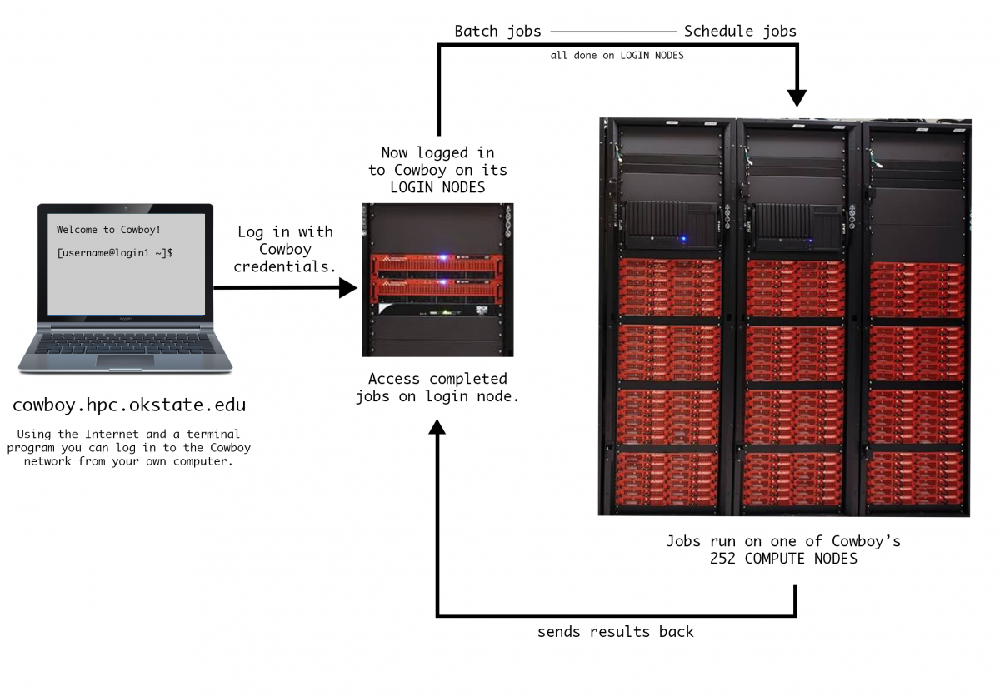
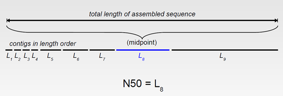

# Week 4 - February 7, 2017
## Lesson Notes

___

# What is the purpose of this class?

We've had a few questions and comments about what the purpose of the course is. We realize that we haven't made that fully clear.

We want to take you through a series of real-world HPC problems so you can see the variety of research, code, programs, etc. being done on just the OSU supercomputer alone. The purpose is to expose you to research that you may not have had the opportunity to learn about outside of your major, while also helping you learn skills to navigate supercomputing systems, and finally seeing how HPC helps research as part of the bigger picture!

# What is the purpose of this Bioinformatics exercise?

Weeks 2-4 will involve working on a real-world HPC Bioinformatics problem involving genome assembly:
[Bioinformatics](http://hpcc.okstate.edu/bioinformatics) is a field that is seeing rapid and growing use of HPC resources. Bioinformatics analyzes increasingly larger and more complex sets of biological data, i.e. genomics, cancer and antibiotics research. Our bioinformatics exercise involves looking at mutated yeast genes. 

We have been given DNA reads from a sequencer with information about the probability of error for each read. Genetic strands are so long that a gene sequencer cannot read the entire thing. For this reason, the sequencer reads sections of the DNA strand and produces a file with a read for each piece. Each read is given its own identifier, and it becomes the job of the biologist to put all the pieces back together. If a so-called reference genome exists, assembler or mapping software can align the reads to the reference and then determine biologically important differences. However, researchers are often interested in new genomes that do not have a reference - known as [de novo assembly](https://www.illumina.com/techniques/sequencing/dna-sequencing/whole-genome-sequencing/de-novo-sequencing.html).

When DNA is prepared for sequencing, it is duplicated many times over and each of these duplicates is broken up in to pieces short enough for the sequencer to read. The hope is to get overlapping sections from the sequencing machine so that the assembler software can piece the entire DNA strand back together. An analogy to this would be to take the entire works of Shakespeare, copy it ten or twenty or more times over and then take each copy and cut it into random pieces. The hope is that there would be enough overlap between pieces from one copy to the next that we could reassemble the entire works of Shakespeare. In Bioinformatics, one way this is done by using [De Bruijn graphs](https://en.wikipedia.org/wiki/De_Bruijn_graph "De Buijn Graphs"), which is a memory intensive operation and requires the use HPC resources for large genomes. Some key terms to keep in mind:

* **Genotype:** the DNA sequence of the genetic makeup of a cell/organism/individual
* **DNA sequencing:** the process of determining the order of the four bases (adenine, guanine, cytosine, and thymine) in a strand of DNA
* **Genome assembly:** the DNA sequence(s) produced after chromosome(s) have been fragmented, those fragments sequenced, and those sequences put back together. 

     


## Overview from last week

1. Last week we were looking at the .fastq files (that contained DNA sequence reads) and how we could combine commands using pipes & filters to create more complex workflows. We used pipes & filters to have the computer do the arithmetic for us to determine the number of reads in a .fastq file.
   * `$ expr $(cat group*/*.fastq | wc -l) / 4`
2. We also looked at how to create loops to run multiple tasks over multiple files.
   * `$ for filename in group*/*.fastq; do expr $(cat $filename | wc -l) / 4; done`
3. Finally, we looked at `grep` and `find` to find _patterns within_ files (grep) and to _find files_ that matched patterns (find). 
   * `$ grep 'AAAAGAATGGAAA' $(find . -name *.fastq) | wc -l`

Notice a pattern? We are continuously building up our commands to make it easier to do multiple things at once. So far we've only done this to look at the sequences, but what about the assembly part? 

## Submission Scripts

To start doing our **de-novo assembly** we are going to be moving into a directory called `velvet`. [**Velvet**](https://en.wikipedia.org/wiki/Velvet_assembler) is the name of a software package for de-novo assembly and short read sequencing alignments using the de Brujin graphs we mentioned earlier.

From our home directory:
```bash
$ cd /scratch/username/mcbios/velvet
```

Let's see what type of files the `velvet` directory contains?
```bash
$ ls
velvetk31.pbs
```

What does the **.pbs** extension mean on the end of this file? Naming a file with a .pbs extension would mean that it is likely a **portable batch system** file. What does that mean? It means you will have to "batch" (set up) your jobs to run through a scheduler. We refer to it as a "submission script".


## PBS -  Submitting Jobs to the Scheduler

Since Cowboy is a shared resource, the most efficient way to balance everybody's jobs is to use a scheduler. Imagine you are wanting to eat at a restaurant that operates on a reservation-based system. You call the restaurant and tell them how many people will be in your party and that you are open to taking whatever time they can fit you in. The restaurant looks at its open reservations and based on its table availability for your party of 10, they make a reservation for you to come in at that time. Similar to the restaurant's reservation staff, Cowboy uses a batch scheduler to manage job submissions.
* If you remember, when you first log in to Cowboy, you'll be on one of its _login nodes_. 
* However, on Cowboy (or any HPC cluster) you won't run your job on the login node. You can edit files here, but when it's time to run a job, you will need to use the batch scheduler command to move you to a compute node. 
* The job scheduler takes some information from you, finds the best compute node(s) to use and runs your job there.



When we submit the submission script, it tells the scheduler where to find our program and what we want Cowboy to do with our program. The scheduler then decides when and how to run the program based on what is most efficient for Cowboy given all the other users' requests. Let's practice submitting a job.

## Submitting a Velvet assembly job

First, let's take a look at the contents of the `velvetk31.pbs` submission script.

```bash
$ cat velvet31k.pbs
#!/bin/bash
#
#PBS - q express
#PBS - j oe
#PBS -l nodes=1:ppn=12
#PBS -l walltime=1:00:00
cd $PBS_O_WORKDIR

module load velvet/1.2.10

export GROUPNUMBER=1
export K=31
export DATADIR=../data/group${GROUPNUMBER}
export OUTPUTDIR=velvet${K}

velveth $OUTPUTDIR ${K} -fastq -shortPaired -separate $DATADIR/PE-350.1.fastq $DATADIR/PE-350.2.fastq

velvetg $OUTPUTDIR -cov_cutoff auto -exp_cov auto -scaffolding yes
```

Wow! That is a lot of information in this one script. Let's break it down to see how it's structured.
* #!/bin/bash - ! is called a [shebang](https://en.wikipedia.org/wiki/Shebang_(Unix)) - helps interpret how the script should run - in this case it's using the bash shell environment
* #PBS -q express - including PBS here interprets that the information on this line should be run as a "portable batch system" (meaning go through the scheduler), -q is the flag for "queue", and 'express' is the queue you are running your job on Cowboy
* #PBS -j oe - this line is also interpreted to send through the scheduler, -j 
* #PBS -l nodes=1:ppn=12 - this line tells the scheduler how many nodes and processors per nodes your job will need
* #PBS - l walltime: 1:00:00 - this line tells the scheduler how much walltime you need for your job to run
* cd $PBS_O_WORKDIR - changes into the directory where the script was submitted before running the job. This means output from the job will be saved in the same directory as the submission script.
* module load velvet/1.2.10 - Load the Velvet software for use. Analogous to clicking on an appliction in the start bar of a GUI-based operating system.
* export ... - each of these lines set an environment variable that we use to to make it easier to avoid typos in the velvet commands below.
* velveth/velvetg ... - these lines actually run Velvet on our data.

Let's practice submitting our job to the scheduler. To submit the job use the qsub command:
 
```bash
$ qsub velvetk31.pbs 
898.mgmt1
```

This command submits the job to the batch scheduler, and returns a job ID number (in this example, it is 898, but will be a different number when you run it).

To see all the jobs running on Cowboy, type:

```bash
$ showq
```

It can take several seconds for your job to launch, so if you don't see it at first, please wait a bit and try again.
 
To view only your jobs, add the `grep` command.
 
```bash
$ showq | grep yourusername
```

```bash
898 yourusername  Running  1  00:59:28  Tue Sep 18 11:02:23
```

You can stop (kill) your job using this command:

```bash
$ qdel 898
```
 
Once your job finishes, you can look at the output file and directory created by the scheduler. Their name will be of the form jobname.ojobidnumber.

```bash
$ ls
velvet31  velvetk31.pbs  velvetk31.pbs.o898
```

Let's look and see what the output of the job was.

```bash
$ less velvetk31.pbs.o898
```

```bash
[0.000001] Reading FastQ file ../data/group1/PE-350.1.fastq;
[0.019356] Reading FastQ file ../data/group1/PE-350.2.fastq;
[1.296147] 190768 sequences found in total in the paired sequence files
[1.296150] Done
[1.527381] Reading read set file velvet31/Sequences;
[1.750945] 190768 sequences found
[2.252361] Done
[2.252368] 190768 sequences in total.
[2.256397] Writing into roadmap file velvet31/Roadmaps...
[2.338551] Inputting sequences...
[2.338557] Inputting sequence 0 / 190768
[4.623158]  === Sequences loaded in 2.288874 s
[5.207822] Done inputting sequences
[5.207829] Destroying splay table
[5.208951] Splay table destroyed
[0.000000] Reading roadmap file velvet31/Roadmaps
[0.982186] 190768 roadmaps read
[0.982452] Creating insertion markers
[1.011355] Ordering insertion markers
[1.147174] Counting preNodes
[1.167871] 255547 preNodes counted, creating them now
[1.872898] Adjusting marker info...
[1.892067] Connecting preNodes
[2.041430] Cleaning up memory
[2.041671] Done creating preGraph
[2.041673] Concatenation...
[2.110394] Renumbering preNodes
[2.110398] Initial preNode count 255547
[2.112308] Destroyed 245108 preNodes
[2.112310] Concatenation over!
[2.112311] Clipping short tips off preGraph
[2.113709] Concatenation...
[2.118483] Renumbering preNodes
[2.118484] Initial preNode count 10439
[2.119207] Destroyed 4321 preNodes
[2.119209] Concatenation over!
[2.119209] 2186 tips cut off
[2.119210] 6118 nodes left
[2.123014] Writing into pregraph file velvet31/PreGraph...
[2.248734] Reading read set file velvet31/Sequences;
[2.523069] 190768 sequences found
[3.024276] Done
[3.107128] Reading pre-graph file velvet31/PreGraph
[3.107239] Graph has 6118 nodes and 190768 sequences
[3.147526] Scanning pre-graph file velvet31/PreGraph for k-mers
[3.165531] 622918 kmers found
[3.211406] Sorting kmer occurence table ... 
:
```

This is the output that you would have seen on your screen if you had run the job in a terminal on your computer. Instead, Cowboy saves the output into a file that we can go read later. This way, we can go do something else while Cowboy crunches away at our data. Congratulations, you have submitted your first job to Cowboy. You have also completed your first gene assembly as well.

Let's take a closer look at the end of our output file.  
```bash
$ tail velvetk31.pbs.o898

[8.143083] Renumbering nodes
[8.143083] Initial node count 123
[8.143084] Removed 0 null nodes
[8.143085] Concatenation over!
[8.157253] Writing contigs into velvet31/contigs.fa...
[8.328972] Writing into stats file velvet31/stats.txt...
[8.353523] Writing into graph file velvet31/LastGraph...
[8.628594] Estimated Coverage = 19.182049
[8.628602] Estimated Coverage cutoff = 9.591024
Final graph has 123 nodes and n50 of 133120, max 244368, total 567437, using 190170/190768 reads
```

We see that velvet put the "contigs" file in velvet31/contigs.fa.  And it has an n50 of 133120. (We'll discuss what this means in class.)  

Different assembler programs and different kmer values will produce different assemblies.  So one thing we can do is run velvet with other kmer values and then compare the assemblies (the contigs file) and try to determine which one is better.  

First lets put this contigs (assembled) file into our results directory for later comparison:

```bash
$ cp velvet31/contigs.fa ../results/velvet31.fasta
```
Note our naming convention in the results folder indicates the assembler program and the kmer value for later reference.

Now, let's walk through running velvet with a different kmer. 

```bash
$ cp velvetk31.pbs velvetk21.pbs
$ nano  velvetk21.pbs
```
While in nano, change the `K=31` to `K=21`, save the file and exit nano.  Now submit the new job:

```bash
$ qsub velvetk21.pbs
```

When it's done, copy it's resulting contigs file to the results directory:

```bash
$ cp velvet21/contigs.fa ../results/velvet21.fasta
```
If desired, you can try velvet with a kmer of 25 as well... just remember to copy the resulting contigs file to the results directory.

## Submitting an Abyss assembly job

You may have noticed we also have an `abyss` and a `soap` directory.  These are two other assembler programs before doing a final analysis of all our assembly results. 

To run the abyss assembler, make your way to the `mcbios/abyss/abyss31` directory and take a look at the `abyssk31.pbs` we have prepared for you. 

```bash
$ cat abyssk31.pbs
#!/bin/bash
#
#PBS -q express
#PBS -j oe
#PBS -l nodes=1:ppn=12
#PBS -l walltime=1:00:00
cd $PBS_O_WORKDIR

module load abyss/1.3.7-openmpi-intel

export GROUPNUMBER=1
export K=31
export DATADIR=../../data/group${GROUPNUMBER}
export OUTPUT=abyss${K}

abyss-pe  k=$K name=$OUTPUT  lib="pe350" \
    pe350='${DATADIR}/PE-350.1.fastq ${DATADIR}/PE-350.2.fastq'
```
Note the similarities and differences with the velvet submission script we submitted earlier. 


Submit this job:

```bash
$ qsub abyssk31.pbs
```

When it is done, we can gather a bit of information from the output file:

```bash
$ grep ^Assembled abyssk31.pbs.o<jobidnumber>
Assembled 563522 k-mer in 245 contigs.
```
Can you also find the n50, max contig length and the total length from that file? 

And finally, let's copy the scaffolds file (scaffolds are even "better" than contigs) to our results directory:

```bash
$ cp abyss31-scaffolds.fa ../../results/abyss31.fasta
```
Just as we did with velvet, we can run abyss with other kmers (try 21 adn 25), but we need to create a new directory first:

```bash 
$ cd ..
$ pwd  
/scratch/username/mcbios/abyss
$ mkdir abyss21
$ cp abyss31/abyssk31.pbs abyss21/abyssk21.pbs
$ cd abyss21
$ nano  abyssk21.pbs
```
While in nano, change K from 31 to 21 and then submit:

```bash
qsub abyssk21.pbs
```
When it's done copy the scaffold file to your results folder:

```bash
$ cp abyss21-scaffolds.fa ../../results/abyss21.fasta
```

## Submitting a [SOAPdenovo2](http://soap.genomics.org.cn/soapdenovo.html)  assembly job

First change to the soap31 subdirectory

```bash
$ cd ../../soap/soap31
$ ls 
soap.config  soapk31.pbs
```

SOAPdenovo is different as it uses a configuration file “soap.config”, where we tell SOAP what our data are. 

```bash
$ cat soap.config
[LIB]
avg_ins=350
reverse_seq=0
asm_flags=3
rank=1
q1=../data/group1/PE-350.1.fastq
q2=../data/group1/PE-350.2.fastq

$ cat soapk31.pbs
#!/bin/bash
#
#PBS -q express
#PBS -j oe
#PBS -l nodes=1:ppn=12
#PBS -l walltime=1:00:00
cd $PBS_O_WORKDIR

module load soapdenovo
export K=31

SOAPdenovo-63mer all -p 12 -s soap.config -o soap${K} -K $K >soap.log
```

What is different from the previous submission scripts?  What's the same?  What kmer value are we using?

Next, submit the soapdenovo assembly job:

```
$ qsub soapk31.pbs
```

When it's finished: The `soapk31.pbs.o<jobid>` is very useful. Use the `more` command to find these information from the log file:
Paired end library insert size: _____________   Standard deviation ______________
contig stats: n50 ________  max length contig _______ total __________ 

Can you figure out where the results are stored?

And just like before, let's copy the resulting contig file into our results directory:
```
$ cp soap31.scafSeq ../../results/soap31.fasta
```

Does the assembly get better  if I use a different K-mer size?
To run a different kmer e.g ‘21’, create a new soap directory and copy the submit and config files into it. Notice that we are changing the names of the files while copying them to reflect the new kmer we are testing:


```
$ cd ..
$ pwd (make sure you’re in the soap directory)
$ mkdir soap21
$ cp soap31/soapk31.pbs soap21/soapk21.pbs
$ cp soap31/soap.config soap21/.      (that dot at the end is necessary)
$ cd soap21
$ nano  soapk21.pbs 
```

Now modify using nano the `soapk21.pbs` file and change K  from 31 to a 21.  Save the file and submit the new job:

```
$ qsub soapk21.pbs
```

Be sure to copy the resuts to the results folder:

```
$ cp soap21.scafSeq ../../results/soap21.fasta
```

Use what you've learned to do this again with a kmer value of 25.


## Reporting

A contig is a contiguous length of genomic sequence. A scaffold is composed of ordered contigs and gaps. By far the most widely used statistics for describing the quality of a genome assembly are its scaffold and contig N50s. A contig N50 is calculated by first ordering every contig by length from longest to shortest. Next, starting from the longest contig, the lengths of each contig are summed, until this running sum equals one-half of the total length of all contigs in the assembly. The contig N50 of the assembly is the length of the shortest contig in this list. The scaffold N50 is calculated in the same fashion but uses scaffolds rather than contigs. The longer the scaffold N50 is, the better the assembly is. However, it is important to keep in mind that a poor assembly that has forced unrelated reads and contigs into scaffolds can have an erroneously large N50.

N50 statistic is a metric of the length of a set of sequences. N50 is the contig length such that using equal or longer contigs produces half the bases (http://en.wikipedia.org/wiki/N50_statistic).




Navigate to your results folder and we'll run a quick analysis of the assemblies we have so far:

```bash
$ pwd
/scratch/uesrname/mcbios/results
```

```bash
$ module load abyss
$ abyss-fac *.fasta
n       n:500   n:N50   min     N80     N50     N20     E-size  max     sum     name
74      18      3       1284    38728   75899   147212  87678   147212  568035  abyss31.fasta
53      19      3       777     39696   71999   180415  94072   180415  558695  soap31.fasta
64      18      2       504     72262   132899  243540  151840  243540  560611  velvet31.fasta

```

(Note that the output above is not what yours will look like...)

For a very useful report we can also use quast.  If you're already in the results directory, submit `quast.pbs` to the scheduler:

```
$ qsub quast.pbs
```
When that completes, you'll have a quastresults folder that you can dowload to your laptop to look at the html and other files. This will include the reference genome (because we actually had one all along.)  

Which assembly is best? 


