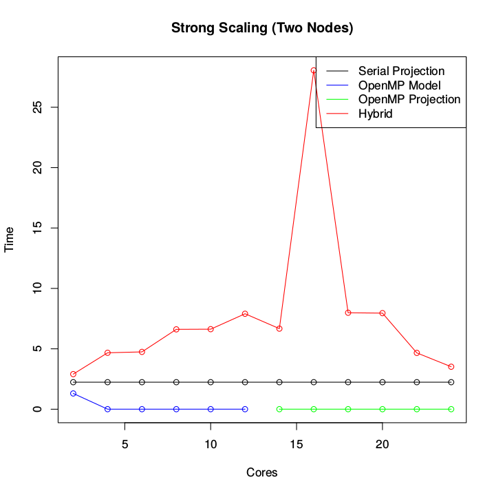
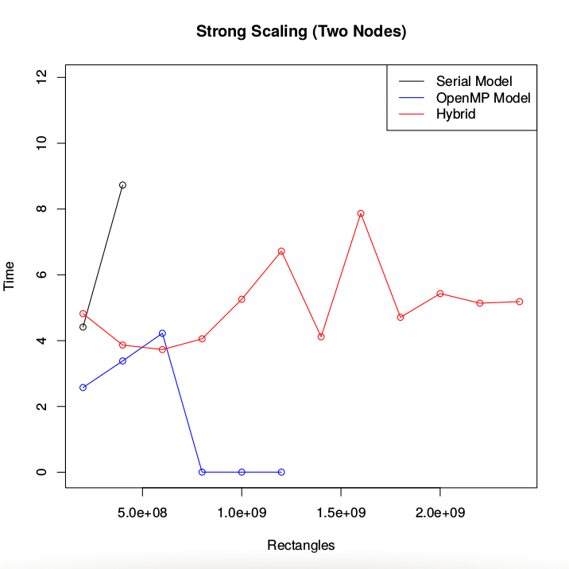

# Strong vs. Weak Scaling
### Based on [*Parallelization: Area Under a Curve*](http://shodor.org/petascale/materials/modules/ "Shodor Education Foundation, Inc.") by Aaron Weeden

## Objectives
* Discuss strong versus weak scaling.
* Discuss how weak scaling is the reason HPC is beneficial.
* Introduce the tools OpenMP and MPI.

## Scaling

Because the purpose of high performance computing to to tackle problems that are "too big" for an individual PC, it is helpful to examine how a computer performs as a given problem gets bigger. That is, as a problem scales (or gets bigger) how does it perform on a given piece of hardware. It would make sense that having a supercomputer with many computers working in parallel would give us a distinct advantage over a single PC running a series of instructions in a serial fashion (for the sake of discussion, let us overlook all the parallel technology that is incorporated into single PCs today). Unfortunately, the situation is not quite that simple. Today, we are going to submit serial and parallel versions of the same code to Cowboy and see how they compare with each other.

## Setup

Let's begin by downloading the code.

```bash
!!!!WGET CODE HERE!!!!  
```

> Note: You can find a copy of the `wget` command on the [etherpad](http://tiger.hpc.okstate.edu/sites/etherpad/p/2017-spring-math2910 "wget command").

Unzip the file and move into the directory called `area`.

```bash
$ unzip scaling.zip 
Archive:  scaling.zip
   creating: area/
   creating: area/data/
   creating: area/results/
   creating: area/scripts/
  inflating: area/scripts/area.c     
  inflating: area/scripts/area.openmp.strong.pbs  
  inflating: area/scripts/area.serial.strong.pbs  
  inflating: area/scripts/Makefile   
  inflating: area/scripts/area.serial.weak.pbs  
  inflating: area/scripts/results.R  
  inflating: area/scripts/area.openmp.weak.pbs  
  inflating: area/scripts/csvtime.sh  
  inflating: area/scripts/area.hybrid.weak.pbs  
  inflating: area/scripts/area.hybrid.strong.pbs  
$ cd area/
```

Notice that in keeping with good data management practices, there are three directories: one for holding data, one for holding results, and one for holding scripts.

```bash
$ ls
data  results  scripts
$ ls data
$ ls results
```

We see that data and results are both currently empty. This is because have multiple scripts we will run for this exercise. Some will create data by running experiments on Cowboy, and some will take the data and generate human-friendly output and put it in the `results` directory.

Now let's have a look inside of the `scripts` folder.

## Riemann Sums

```bash
$ cd scripts/
$ ls
area.c                  area.openmp.strong.pbs  area.serial.weak.pbs  results.R
area.hybrid.strong.pbs  area.openmp.weak.pbs    csvtime.sh
area.hybrid.weak.pbs    area.serial.strong.pbs  Makefile
```

Remember that when we plan to submit a script through the 'Portable Batch System' (aka the scheduler), it is helpful to label them with the extension .pbs, but, as you can see, we also have other scripts in this directory. We will be using all of these scripts in today's exercise, but for now, the only two that concern us are `Makefile` and `area.c`. `area.c` is a program written in the C language that uses Riemann sums to compute an integral. `Makefile` is a special script that works with the program `make` to compile the C program into a binary file that computer can execute.

Recall from calculus that an integral computes the area under a curve. For example, we can see a graph of the equation


below:


The integral


tells us the exact area under the curve from 0 to 1. Recall that one way we can approximate this area is by using Riemann sums. The idea behind a Riemann sum is to divide the interval 0 to 1 up into subintervals and draw rectangles at each interval whose top-middle point meets the curve. Drawing ten rectangles under our curve would look like the following:


We can compute the area of these rectangles, add them together, and get an approximation of the area under the curve. Notice that with ten rectangles our approximation of pi is too large because the rectangles do not fit perfectly under the curve. We can reduce this error making the rectangles smaller and drawing more of them. Here is what the approximation looks like for fifty rectangles:


We can do even better with 100 rectangles, but we see that even then, the approximation is still a little bit too large.


The theory of calculus tells us that if we continue letting the rectangles get smaller and smaller, until they are infinitely small, we would get the exact value of pi. However, computers use floating point arithmetic, which means we do not get the luxury of "infinitely small." Instead, we will have to settle for really small. For this exercise, we will start with 100,000,000 rectangles and go up from there. It will loop through each rectangle and compute it area, adding up all the areas at the end.

## Compiling the Code

Recall that in a serial implementation of this algorithm, there is one loop that steps through each rectangle one at a time. The author of this code was creative and designed it so that it could be compiled both as serial and as parallel code. Let's compile the serial binary.

```bash
$ make serial
make area.serial
make[1]: Entering directory `/panfs/panfs.cluster/home/your-username/area/scripts'
gcc  area.c -o area.serial
make[1]: Leaving directory `/panfs/panfs.cluster/home/your-username/area/scripts'
$ ls
area.c                  area.openmp.weak.pbs    csvtime.sh
area.hybrid.strong.pbs  area.serial             Makefile
area.hybrid.weak.pbs    area.serial.strong.pbs  results.R
area.openmp.strong.pbs  area.serial.weak.pbs
```

Notice we have a new binary file: `area.serial`. We also need code for running our algorithm in parallel. There are two tools commonly used when writing parallel code: [Open Multi-Processing](http://www.openmp.org/ "OpenMP"), or OpenMP, and [Message Passing Interface](https://en.wikipedia.org/wiki/Message_Passing_Interface "MPI"), or MPI. OpenMP is designed with a shared memory model in mind. That means when we write code that uses OpenMP, we can use all the cores available to us on a single computer's processor(s), but we cannot communicate with another computer that may be connected to that computer. MPI, on the other hand, uses a distributed memory model, so code using MPI can be run across several computers at the same time. On a computing cluster like cowboy, we want to design code that can be run across several machines and use all the cores available in the processors of those machines. Therefore, we want to write code that takes advantage of both MPI and OpenMP at the same time. We call such code *hybrid* code. Let's compile both OpenMP and hybrid versions of `area.c`.

> **Can we show them here how to look which version is available? I know it's not directly related to the lesson objectives, but I always have found it useful to know how to do this** - Jamie

```bash
$ module load openmpi-1.4
$ make openmp
make area.openmp
make[1]: Entering directory `/panfs/panfs.cluster/home/your-username/area/scripts'
gcc  -fopenmp -DOPENMP area.c -o area.openmp
make[1]: Leaving directory `/panfs/panfs.cluster/home/your-username/area/scripts'
$ make hybrid
make area.hybrid
make[1]: Entering directory `/panfs/panfs.cluster/home/your-username/area/scripts'
mpicc  -DMPI -fopenmp -DOPENMP area.c -o area.hybrid
make[1]: Leaving directory `/panfs/panfs.cluster/home/your-username/area/scripts'
$ ls
area.c                  area.openmp.strong.pbs  csvtime.sh
area.hybrid             area.openmp.weak.pbs    Makefile
area.hybrid.strong.pbs  area.serial             results.R
area.hybrid.weak.pbs    area.serial.strong.pbs
area.openmp             area.serial.weak.pbs
```

## Strong Scaling

When we talk about scaling an algorithm, we can talk about both strong and weak scaling. *Strong scaling* is the idea that given a problem, if we use more nodes/threads to solve the problem, it should speed up how long it takes to complete the problem. This makes a lot of sense, more workers means the work goes quicker. Consider a pond full of fish. If we want to be environmentally irresponsible and fish all the fish and package them for sale, then ten people fishing will certainly get the job done faster than one person fishing. Furthermore, if only one person can run the packaging machine, then the time to finish the job will always be limited by the amount of time it takes for the one person packaging the fish to finish. Compounding the problem is that the more people fishing, the more they get in each other's way. In other words, having more people fishing at the same time will provide diminishing returns on the amount of time we save to finish the job. 


This is the idea of [Amdahl's Law](https://en.wikipedia.org/wiki/Amdahl's_law "Amdahl's Law"). It says that there will alway be some part of our code that does not benefit from parallelism. This means our code is always restricted by this part and there is an upper limit on the amount of speed we gain by writing parallel code. Compounding the issue is the overhead of communication between multiple processes.

We have several submission scripts in this example that will put this to the test on Cowboy. Let's have a look.

> Look at each of the `area.*.strong.pbs` submission scripts and discuss with the class the big idea of what they are doing. Students don't need to worry about every detail. What elements have we seen in class so far? What elements are new?
> **Start with serial first?? Then OpenMP, then hybrid??** - Jamie

Let's submit our jobs and put Amdahl's Law to the test on Cowboy.

```bash
$ for script in area.*.strong.pbs
> do
> echo $script
> done
area.hybrid.strong.pbs
area.openmp.strong.pbs
area.serial.strong.pbs
$ for script in area.*.strong.pbs; do qsub $script; done 
749867.mgmt1
749868.mgmt1
749869.mgmt1
```

## Weak Scaling

According to Amdahl's Law and the theory of strong scaling means high performance clusters like Cowboy are a waste of resources and money, so why do research institutions and governments spend millions of dollars on such systems? The answer is weak scaling. Returning to our fishing example, suppose we have discovered that by adding a third person fishing the lake, we do not gain any more speedup. We decide instead on a crew of two people fishing the lake and one person packaging the fish. 


Choosing to expand the business, we want to fish out several lakes. If we have several hundred lakes to fish out, the three person crew will be busy for quite some time. On the other hand, we could send out a three person crew to each lake, making the amount of time to finish all the lakes the same as finishing one lake. This is the idea behind *weak scaling*. Weak scaling says that as a problem size increases, we can increase the number of nodes/threads used to compute the problem, maintaining the faster speeds of the smaller version of the problem.

Notice that we hit a speed limit when fishing individual lakes, but we could still benefit from lots of workers for multiple lakes. They were two different types of problems. **<-- What does sentence this mean? - Jamie** This is true in research computing as well. The reason high performance clusters like Cowboy have become such useful tools in research is that there are many research problems that lend themselves to a parallel solution that takes advantage of weak scaling. It takes careful work, and difficult coding for a researcher to frame their problem correctly before taking advantage of tools like Cowboy.

Let's have a look at our weak scaling submission scripts.

> Look at the contents of the `area.*.weak.pbs` scripts and discuss big picture ideas with students.

We will now put weak scaling to the test on Cowboy.

```bash
$ for script in area.*.weak.pbs
> do
> echo $script
> done
area.hybrid.weak.pbs
area.openmp.weak.pbs
area.serial.weak.pbs
$ for script in area.*.weak.pbs; do qsub $script; done
749871.mgmt1
749872.mgmt1
749873.mgmt1
```
> **Do we have a guarantee we can get these results back during class? Have we talked to Jesse?** - Jamie

## Looking at the Results

We can check on the status of our results by looking using `cat` to look at the `area.*pbs.o*` files. Once all our jobs have finished, we should have output files for all six jobs.

```bash
$ cat area.serial.weak.pbs.o749873 
100000000 rectangles completed successfully!
200000000 rectangles completed successfully!
300000000 rectangles completed successfully!
400000000 rectangles completed successfully!
```

If we look at one of the output files, we see that it is a `.csv` file which is nice for the computer, but not humans.

```bash
$ cat ../data/serial-weak.csv 
1,1,1,100000000,0,2.249
1,1,1,200000000,0,4.413
1,1,1,300000000,0,6.558
1,1,1,400000000,0,8.728
```

The last script in our `/scripts` directory is script written in R. It will process the `.csv` files and compile two `.csv` files with strong and weak scaling results. It also creates nice plots of the data that are preferable for human eyes. Let's run `results.R`.

**Ran into problem here with $ Rscript command**

```bash
$ Rscript results.R 
null device 
          1 
null device 
          1 
```

Let's see what it did to our data.

```bash
$ cd ../results/
$ ls
strong.csv  strong-scaling.pdf  weak.csv  weak-scaling.pdf
```

We have two `.pdf` files with graphs, and two `.csv` files with compiled results. Use the file transfer application of your choice to move the files to your machine and have a look.

> You can use any spreadsheet program to open the `.csv` files.

## Interpreting the Results

### Strong Scaling Results

If we open `strong.csv` in our favorite spreadsheet program, we see something similar to the following table. Notice there are several places where where the time to complete the job is 'NA'. That is because a serial program cannot take advantage of more than one core and an OpenMP program cannot take advantage of more than one node. Also notice that the number of rectangles did not change. When looking at strong scaling, we want to know how a constant job size changes as the number of nodes/threads changes.

> What interesting results do you notice in results?

|"Nodes"|"Cores/Node"|"Cores"|"Rectangles"|"Serial"|"OpenMP"|"Hybrid"|
| --- | --- | --- | --- | --- | --- | --- |
|1|1|1|100000000|2.238|2.213|15.507|
|1|2|2|100000000|NA|1.305|8.67|
|1|3|3|100000000|NA|1.02|4.073|
|1|4|4|100000000|NA|0.004|4.125|
|1|5|5|100000000|NA|0.004|1.671|
|1|6|6|100000000|NA|0.004|3.8|
|1|7|7|100000000|NA|0.004|3.965|
|1|8|8|100000000|NA|0.004|1.987|
|1|9|9|100000000|NA|0.004|4.157|
|1|10|10|100000000|NA|0.005|4.258|
|1|11|11|100000000|NA|0.004|5.012|
|1|12|12|100000000|NA|0.004|4.808|
|2|1|2|100000000|NA|NA|2.906|
|2|2|4|100000000|NA|NA|4.672|
|2|3|6|100000000|NA|NA|4.746|
|2|4|8|100000000|NA|NA|6.612|
|2|5|10|100000000|NA|NA|6.626|
|2|6|12|100000000|NA|NA|7.903|
|2|7|14|100000000|NA|NA|6.671|
|2|8|16|100000000|NA|NA|28.054|
|2|9|18|100000000|NA|NA|7.987|
|2|10|20|100000000|NA|NA|7.954|
|2|11|22|100000000|NA|NA|4.663|
|2|12|24|100000000|NA|NA|3.517|

Now let's look at the strong scaling plots.


### Strong Scaling on One Node

Notice the following observations about the above graph.

* We see the principal of strong scaling for both the hybrid and OpenMP versions of the program. Notice that we initially get speedup by adding more cores, but we don't see serious gains in speed after four cores.

* For one core, the serial version and OpenMP version start at the same time.

* Adding more cores and running the serial version of the software won't change the time it takes to compute the job. You will just have several cores doing nothing while one core does the work. In fact, the job might run slower due to the extra overhead of starting up more cores. For argument sake, assume the time remains the same as when only one core is being used. This is represented by the green line on the graph. Notice it never becomes worthwhile to program a hybrid version. This makes sense since the hybrid version is designed to work on multiple nodes, not just one.

* It is worthwhile to program an OpenMP version for one node, but it doesn't help us to use more than four cores.

* For one node there is a huge difference between the hybrid code and the OpenMP code. There's a lot of extra overhead to begin a MPI job.



### Strong Scaling on Two Nodes

* The results are similar.

* The hybrid version never completes as quickly as the serial version.

* The serial and OpenMP versions have similar results, with OpenMP being slightly faster.

* We don't have any gains in the OpenMP version beyond four threads.

* It's not worth our time to run a job computing 100,000,000 boxes on more than one node with four threads.

* Strong scaling shows us that high performance computing is a last line of defense. It is useful to investigate all possibilities for speeding up our program on a personal computer before resorting to a parallel computing.

> How do your results compare to these? What interesting things happened?

### Weak Scaling Results

Now let's have a look at the weak scaling results. Open `weak.csv`, and take a look.

|"Nodes"|"Cores/Node"|"Cores"|"Rectangles"|"Serial"|"OpenMP"|"Hybrid"|
| --- | --- | --- | --- | --- | --- | --- |
|1|1|1|1e+08|2.249|2.203|11.907|
|1|2|2|2e+08|4.413|2.574|6.785|
|1|3|3|3e+08|6.558|0.004|3.972|
|1|4|4|4e+08|8.728|3.383|7.5|
|1|5|5|5e+08|NA|3.809|4.843|
|1|6|6|6e+08|NA|4.224|8.426|
|1|7|7|7e+08|NA|0.004|5.034|
|1|8|8|8e+08|NA|0.004|4.561|
|1|9|9|9e+08|NA|0.004|5.446|
|1|10|10|1e+09|NA|0.004|3.558|
|1|11|11|1.1e+09|NA|0.006|9.981|
|1|12|12|1.2e+09|NA|0.004|3.015|
|2|1|2|2e+08|NA|NA|4.821|
|2|2|4|4e+08|NA|NA|3.866|
|2|3|6|6e+08|NA|NA|3.729|
|2|4|8|8e+08|NA|NA|4.056|
|2|5|10|1e+09|NA|NA|5.258|
|2|6|12|1.2e+09|NA|NA|6.719|
|2|7|14|1.4e+09|NA|NA|4.117|
|2|8|16|1.6e+09|NA|NA|7.866|
|2|9|18|1.8e+09|NA|NA|4.709|
|2|10|20|2e+09|NA|NA|5.43|
|2|11|22|2.2e+09|NA|NA|5.138|
|2|12|24|2.4e+09|NA|NA|5.186|

> Do you notice anything interesting?

We can also open the `.pdf` file for the weak scaling plots.


### Weak Scaling on One Node

* Remember we are increasing the number of squares being computed. Each time we add a thread, we add 100,000,000 squares to the Riemann sum.

* OpenMP is still the winner on one node.

* Serial is now a big loser. After just 400,000,000 squares, it is well on its way to being the slowest job to complete.

* After just three cores, hybrid (with all its extra overhead) is already finishing faster than the serial job.



### Weak Scaling on Two Nodes

* We do not even need to bother running serial on more than 400,000,000 squares.
* OpenMP is a big winner, but it's usefulness is limited to one node. That means we can only scale it to 1,200,000,000 squares. Beyond that, we will start taxing its resources just as we did with the serial job.

* The hybrid version of the code finally begins to show its advantages. Notice that after 1,400,000,000 cores, the time to complete the job is reasonably close to the original serial job.

* While the hybrid version bounces back and forth, it stays generally level with only a slight rise from beginning to end. We have a lot of overhead to deal with initially, but as the job size increases, the time the hybrid job takes stays fairly consistent. In contrast both OpenMP and serial versions will eventually take much longer.

* Weak scaling shows us that for the right type of problem, that is sufficiently large in size, resources like Cowboy can be a great asset.

> What does your data look like? How is it different than this run?
